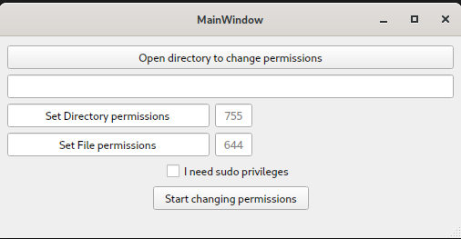

# changepermissions

Python GUI to change file and directory permissions

How to use ?

1.  clone the repository : https://github.com/jobraconse/changepermissions.git

2. cd into the directory changepermissions

3. run the command: `python3 -m venv venv` (to create a virtual environment)

4. run the command: `source venv/bin/activate`

5. run the command: `pip install -r requirements.txt`

6. run the command:` ./main.py`

Enjoy :)

